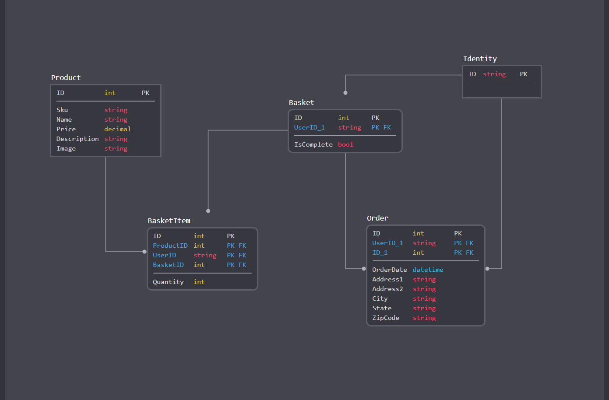

# Squrriels with Ties
[Squirrels with Ties](https://squirrelwithties.azurewebsites.net/)

Create a E-Commerce Website built using sprints and agile programming. ASP.NET core was used as a framework for building out the application

## What do we sell?
Our E-commerce site sells an assortment of squirrel based merchendise. From unsual squrriel mints to squirrel masks, we try to gather as many squrriel 
based goodies for purchase to the general public.

## Claims Captured and Why
We are currently capturing Name, Email, and their favorite animal. The name is captured so that we are able to display a personalized experience 
as soon as the user registers or logs in. The favoirte animal is captured for users to access a animal-lover page where they are able to vote on
the next animal merchnendise we are going to sell. (The Page is under construction) Finally, Email is captured and not currently used but we forsee 
its use in the future to verify purchases(Perhaps).

## Policy we are enforcing
We are enforcing one policy at the monment, AdminOnly. AdminOnly policy allows access to the admin controller only if your role
is admin. There, admins are currently able to create, update, get, delete any of the products in the inventory.

## Database Schema

## Database Schema Explanation
Users are stored in the Identity table. For simplicity, we only included the string ID of the user in the schema. 
Every user has a Basket. This is illustrated by the UserID Foreign key in the basket table. 

The Product table contains all the necessary information on each product. When a user adds an item to their basket,
a basket item is created and stored in the BasketItem Table. Each BasketItem has a productID to know which item was 
put into the basket and a BasketID to know which basket it was put inside of. Once the user completed the checkout,
a Order is created with their shipping address, UserID to know which user checkedout, and BasketID to know which basket
was checked out.

## Getting Started
Follow the link to the website and explore the wide variety of squirrel products.

# Authors
Anthony Green
Mario Nisho

